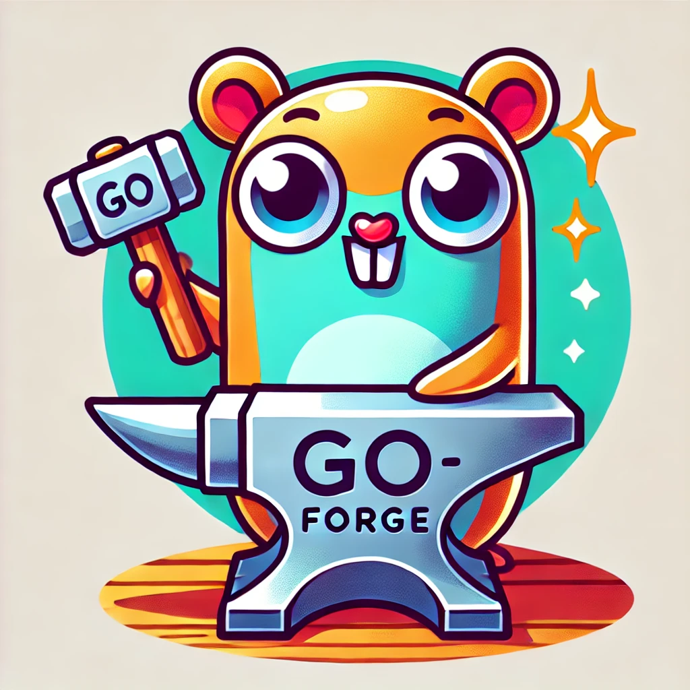

#
# GoForge
GoForge is a command-line interface (CLI) tool designed to streamline the setup of new API projects for Go developers. 

With GoForge, you can quickly generate a well-structured project skeleton, allowing you to focus on writing actual code rather than spending time on boilerplate setup.


### Installing the tool

To install the GoForge tool, use the following command:

```
go install github.com/tz3/goforge@latest
```

Ensure that the binary is in your $GOPATH. If it is not, you may need to add it manually.

### Running the application

To create a new project using GoForge, open your terminal and execute:

```
goforge create
```

You can also set up a project without interacting with the UI by using flags. For example, to create a project named "my-project" with the Gin framework, use:

```
goforge create --title my-project --framework standard-library
```

For a full list of options and shorthands, run:

```
goforge create -h
```